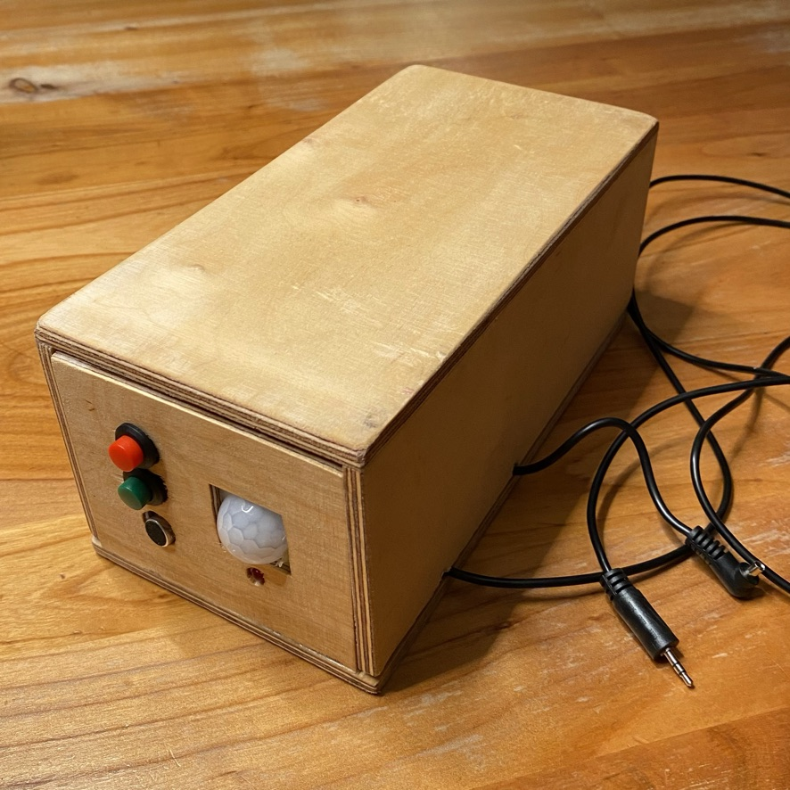
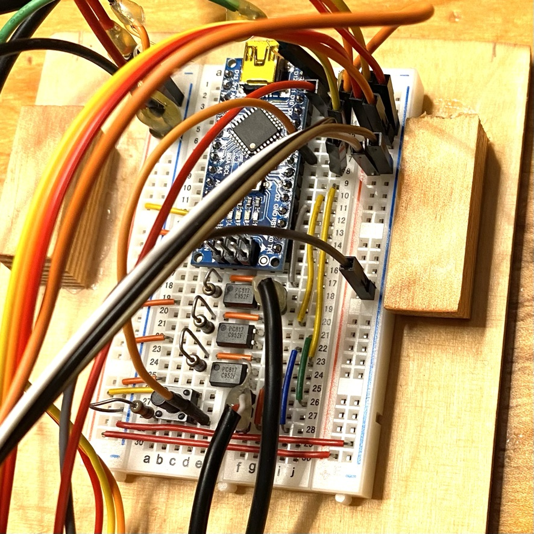

# FotoTrap - an open hardware foto trap

FotoTrap is an open source / open hardware project to build a high speed fotography trigger and a foto trap to take fotos of animals in the wild.

## Usage of High Speed Mode

### Preparation
1. Connect you room light to the relais. Do this in such a way that the light is turned off, when the relais is pulled up.
2. Connect your flash to the pc cable. If there is no connector for the pc sync cable, use a horse shoe adapter.
Make sure to connect the flash correctly to the horse shoe adapter. The front side of the flash must be headed to the closed side of the horse shoe adapter (like mounting the flash from the rear end of your camera).
3. Connect your camera to the trigger cable (stereo jack).
4. Connect the FotoTrap to a power supply. Either connect a 9V battery to Gnd and Vin of the Arduino on the Bread Board or, connect the Arduino to an USB power supply.
5. Turn on your flash, choose the lowest flash energy possible (this will result in the shortest exposure time).
6. Turn on your camera. Choose camera settings so that the sutter is opened and closed via the trigger cable (remote electronic trigger).
7. Do a manual focus and go into bulb mode.

### Take the picture


1. Press the green button. This will pull the relais, so the light is turned off. And the shutter will be opened. The LED will start to blink.
2. After the LED has stopped blinking the FotoTrap is listening for any sharp noise.
3. Take a needle and pop a balloon, take a hammer and smash a glass,...
4. The sound will be registered by the microphone and a flash will be triggered. The shutter will be closed and the relais will be released, so that the light will be turned back on.
5. Inspect your foto and adjust distance of flash etc. You might find it use full to go for indirect lighting.
6. You might need to adjust the sensitivity of the microphone. You can do so by adjusting the trimmer on the microphone module. Be careful when turning the trimmer. There are two green LEDs on the module. The first LED is the power on LED, this should be constantly on. The second LED is flushed whenever the microphone detects a sound. So you can watch this second LED to find the best position of the trimmer.

## Build the FotoTrap

### Housing

The FotoTrap is put in a box to house all the components.



From the outside you see a red button. Pressing the red button turns on the motion-detection-mode. In this mode the camera is triggered when the PIR detects a motion.

The green button triggers the high-speed-fotography-mode. In this mode the flash is triggered when the microphone detects a sound. The microphone is below the green button. Under the PIR you see a status LED.

There are two cables the radio jack cable to trigger the camera and the pc sync cable to trigger the flash.

The FotoTrap is build with an Arduino nano, that is installed on a bread board together with some opto-couplers. Microphone, and PIR are attached to the housing. Jumper wires connect detectors, buttons and status LED to the bread board. The trigger wires are soldered to multipin connectors which are placed directly on the bread board. A cord grip is used to prevent that the triggers are pulled out fromt the bread board.


The microphone module and the PIR have trimmers to adjust for their sensitivity. (on the PIR there are two trimmers, one for sensitivity, the other for the time, when the PIR is set to waiting mode after detecting a motion.)

The sensors are hot glued to the housing, as well as the relais. Buttons are just screwed to the front panel.


We use a breadboard to build up the control circuit. This is the easies way and it allows for changes later on.


The Arduino is placed so that the USB plug is positioned to the rear of the box. So the USB cable can easily be connected to reprogram the microcontroller.

The pins in the trigger cables need to be shortcutted in order to trigger the flash or the camera respectively. This is done by optocouplers which form the central part in the circuit (besides the Arduino).



### Components

1. Arduino nano with an ATmega328. I bought this on [Amazon](https://smile.amazon.de/gp/product/B078SBBST6/ref=ppx_yo_dt_b_asin_title_o08_s01?ie=UTF8&psc=1). Order a couple of these, they are cheap, and you might damage some during setup. There is an excellent Tutoria on how to solder the pins to the Arduino nano on [youtube](https://www.youtube.com/watch?v=wDbUChzxIrE).


2. A microphone module like the youmile detecor module, which can be purchased on [Amazon](https://smile.amazon.de/gp/product/B07Q1BYDS7/ref=ppx_yo_dt_b_asin_title_o07_s00?ie=UTF8&psc=1). The microphone is connected to the breadboard to provide Vin (5V+) and GND. The signal is provided by the OUT Pin, it is directly connected to a digital-read-pin on the Arduino. There are two green LED on the microphone controller. The first LED is on when the micorophone is connected to power, the second LED is flushed when a sound is detectd. The sensitivity can be adjusted with the trimmer / potentiometer. ATTENTION: The signal goes to LOW when a sound is detected. .
3. The infrared motion detector. I use a module from AZDelivery on [Amazon](https://smile.amazon.de/gp/product/B07CNBYRQ7/ref=ppx_yo_dt_b_asin_title_o08_s01?ie=UTF8&psc=1). The semispherical cap can be removed, then you see the printing of the lables of pins (again Vin, GND and OUT). On the module there is a jumper bridge and two trimmers. The jumper should be set to the edge of the board, then the circuit is in binary detection mode. The two potentiometers set sensitivity and a timer for the detection interval. We will not need the latter, because we will time the detection interval on the Arduino


4. The Relais is also from AZDelivery and can be purchased on [Amazon](https://smile.amazon.de/gp/product/B07TYG14N6/ref=ppx_yo_dt_b_asin_title_o08_s00?ie=UTF8&psc=1) as well. Again we have Vin and GND and a signal pin. As the relais is not a detector but an actor, we connect the IN pin to a digital-write-pin on the Arduino. The consumer is connected to the screw terminals. You will only use two of the three terminals. Either the two at the top, or the two at the bottom. This depends wether you want to open or close the circuit when the relais is pulled up.


5. The optocoupler are central for the project. I used PC817 from [Amazon](https://smile.amazon.de/gp/product/B07X46SYQT/ref=ppx_yo_dt_b_asin_title_o09_s00?ie=UTF8&psc=1).


6. A red status LED.

7. A micro button in DIP packaging to be installed directly on the breadboard (for testing purposes).

8. Several resistors. Use a [color code calculatur](https://www.digikey.de/en/resources/conversion-calculators/conversion-calculator-resistor-color-code). To find the right resistors.
3x 240 &Omega; for the pull up buttons. 3x 560 &Omega; for the opto couplers. 1x 100 &Omega; for the red LED.

9. A green and a red button, e.g. from [Amazon](https://www.amazon.de/gp/product/B077FH7TGD/ref=ppx_yo_dt_b_asin_title_o08_s00?ie=UTF8&psc=1)


10. A horse shoe flash adapter from [Amazon](https://www.amazon.de/gp/product/B005GR28MK/ref=ppx_yo_dt_b_asin_title_o00_s00?ie=UTF8&psc=1)


### Circuit

Find the Fritzing file in this project.


Yellow cable mark actors (to the relay, to the opto couplers for triggering flash and shutter of the camera). Orange cables mark detectors (from the buttons and from the microphone and motion sensor). Blue cables are GND, red cables are VC +5V.

If we set PIN 1 of a PC817 to HIGH then PIN 3 and 4 will be shortcutted. We use one PC817 for each of the following functions:

1. Shorcut the connections in the PC sync cable, this will trigger the flash. The connection to the flash is shown as a female 2 pole connector in the schematic.
2. Shortcut the base and the middle of a stereo 2.5 mm radio jacl cable. This will trigger the autofocus of the camera.
3. Shortcut the base and the tip of the stereo radio jack cable. This will trigger the shutter of the cable.

The connection to the radio jack cable is shown as a three pole male connector.

There is an excellent description on how to do a remote control of a camera onn [doc-diy.com](https://www.doc-diy.net/photo/remote_pinout/).


I built the FotoTrap for a Fuji VT100, if you have a different camera, you should check out the above source.

In the cable that I have the yellow cable is base / ground, the red cable is connected to the middle section and the white cable is connected to the tip of the radio jack.

The last function is a connection of a relay. This can be used to turn off the light for a high speed fotography. (Also turn the light back on after the foto has been taken).

On the active side there is a red LED used for status indication. Also we can use the builtin LED on PIN 13 for testing purposes. So this PIN has not been used intentionally.

There are three pull up buttons, two external buttons (in the front panel of the housing) and one button on the breadboard, that is used for testing purposes.

We have the two sensors (microphone and motion sensor) in a digital configuration (they either are LOW or HIGH) and are also connected to digital PINs of the Arduino.

### Programming

Here is the complete program:

```java
/*
  FotoTool
  There are two major modes:
  1. High speed fotography: When the microphone detects a sound the flash is triggered
  2. Foto trap: When the PIR detects a motion the autofocus is triggered and then the shutter is triggered

  In each major mode there are two submodes. The tool can be inactive, or waiting for motion (or sound respectively)

 */


int flash = 2;        // when high the opto coupler shortcuts the pc cable
int shutter = 3;      // when high the opto coupler shortcuts the base and the tip from the "klinke", this triggers the shutter
int autofocus = 4;    // when high the opto coupler shortcuts the base and the middle from the "klinke", this starts auto focus
int pir = 5;          // this gets high when a motion is detected
int button = 6;       // internal pull up button for testing purposes
int microphone = 7;   // gets LOW (1) when sound is detected
int relais = 8;       // high pulls the relais
int externalLED = 10; // when high the LED on the front panes is on
int externalRedButton = 11;    // pull up button
int externalGreenButton = 12;  // pull up button
int buildInLED = 13;  

int fotoTrapMode = 0; // is 1 when in fototrap mode
int highSpeedMode = 0;// is 1 when in high speed fotography mode

int fotoTrapSubMode = 0; // is 0 when inactive, is 1 when waiting for motion
int externalRedButtonValue = 0;        // Red button triggers foto trap mode
int externalRedButtonOldValue = 0;

int highSpeedSubMode = 0; // is 0 when inactive, is 1 when waiting for sound
int externalGreenButtonValue = 0;      // Green button triggers high speed mode
int externalGreenButtonOldValue = 0;

int soundDetected = 0;
int motionDetected = 0;

// the setup routine runs once when you press reset:
void setup() {                
  // initialize the digital pin as an output.
  pinMode(buildInLED, OUTPUT);  
  pinMode(externalLED, OUTPUT);
  pinMode(flash, OUTPUT);
  pinMode(shutter, OUTPUT);
  pinMode(autofocus, OUTPUT);
  pinMode(relais, OUTPUT);  
  pinMode(pir, INPUT);
  pinMode(microphone, INPUT);
  pinMode(button, INPUT);
  pinMode(externalRedButton, INPUT);
  pinMode(externalGreenButton, INPUT);
}

// the loop routine runs over and over again forever:
void loop() {
  externalRedButtonValue = digitalRead(externalRedButton);
  if ((externalRedButtonValue == HIGH) && (externalRedButtonOldValue == LOW)){
    fotoTrapMode = 1;
    highSpeedMode = 0;
    fotoTrapSubMode = 1 -fotoTrapSubMode;
    delay(10);
  }
  externalRedButtonOldValue = externalRedButtonValue;
  if (fotoTrapMode == 1){
    if (fotoTrapSubMode == 1){
      digitalWrite(buildInLED, HIGH);
      digitalWrite(externalLED, HIGH);
      motionDetected = digitalRead(pir);
      if (motionDetected == HIGH){
        digitalWrite(autofocus, HIGH); // trigger autofocus
        delay(500);                    // the camera needs some time to trigger the autofocus
        digitalWrite(autofocus, LOW);
        delay(500);                    // wait some time before ..
        digitalWrite(shutter, HIGH);   // triggering the shutter
        delay(500);                    // camera needs a long pulse to trigger the shutter
        digitalWrite(shutter, LOW);
        motionDetected = 0;
        // blink external LED and wait some time before detecting motion again
        digitalWrite(externalLED, LOW);
        delay(1000);
        digitalWrite(externalLED, HIGH);
        delay(1000);
        digitalWrite(externalLED, LOW);
        delay(1000);
        digitalWrite(externalLED, HIGH);
        delay(1000);
        digitalWrite(externalLED, LOW);
        delay(1000);
        digitalWrite(externalLED, HIGH);
        delay(1000);
      }
    }else{
      digitalWrite(buildInLED, LOW);
      digitalWrite(externalLED, LOW);
    }  
  }
  externalGreenButtonValue = digitalRead(externalGreenButton);
  if ((externalGreenButtonValue == HIGH) && (externalGreenButtonOldValue == LOW)){
    fotoTrapMode = 0;
    highSpeedMode = 1;
    highSpeedSubMode = 1;
    delay(10);
    digitalWrite(buildInLED, HIGH);   // We do this for testing purposes, e.g. calibrating the mic via potentiometer
    digitalWrite(relais, HIGH);       // pull the relais to shut a lamp of and darken the room
    digitalWrite(shutter, HIGH);      // we now open the shutter we do this before listening, because the relais or shutter sound
                                      // might trigger the flash
    // fast blink external LED and wait some time before detecting motion again
    digitalWrite(externalLED, LOW);
    delay(500);
    digitalWrite(externalLED, HIGH);
    delay(500);
    digitalWrite(externalLED, LOW);
    delay(500);
    digitalWrite(externalLED, HIGH);
    delay(500);
    digitalWrite(externalLED, LOW);
    delay(500);
    digitalWrite(externalLED, HIGH);
    delay(500);
    digitalWrite(externalLED, LOW);   // end with low, so that the LED does not radiate light when shutter is open
  }
  externalGreenButtonOldValue = externalGreenButtonValue;
  if (highSpeedMode == 1){
    if (highSpeedSubMode == 1){
      soundDetected = digitalRead(microphone);
      if (soundDetected == LOW){
        digitalWrite(flash, HIGH);        // trigger flash
        delay(5);                         // some time for the flash to be triggered
        digitalWrite(flash, LOW);         // let the flash reload
        digitalWrite(shutter, LOW);       // close shutter
        digitalWrite(relais, LOW);        // turn light back on
        digitalWrite(buildInLED, LOW);
        highSpeedSubMode = 0;
      }
    }
  }
}
```

You find the program as a processing file in this project.

I recommend, that you build the sketch and the circuit in small steps. A first step could be to trigger the blinking of the buildInLED and the relay by the button.

```java
/*
  TestButtonAndRelais
  There are two modes:
  a) do nothing
  b) blink the built in LED for a second (and off a second) and at the same time activate the relais in a blinking mode
  Push the pull-up-button to change between these modes

 */

// Pin 13 has an LED connected on most Arduino boards.
// give it a name:
int buildInLED = 13;
int relais = 8;
int button = 6;
int mode = 0;
int buttonValue = 0;
int buttonOldValue = 0;

// the setup routine runs once when you press reset:
void setup() {                
  // initialize the digital pin as an output.
  pinMode(buildInLED, OUTPUT);  
  pinMode(relais, OUTPUT);  
  pinMode(button, INPUT);
}

// the loop routine runs over and over again forever:
void loop() {
  buttonValue = digitalRead(button);
  if ((buttonValue == HIGH) && (buttonOldValue == LOW)){
    mode = 1 - mode;
    delay(10);
  }
  buttonOldValue = buttonValue;
  if (mode == 1){
    digitalWrite(buildInLED, HIGH);   // turn the LED on (HIGH is the voltage level)
    digitalWrite(relais, HIGH);   // turn the LED on (HIGH is the voltage level)
    delay(1000);               // wait for a second
    digitalWrite(buildInLED, LOW);    // turn the LED off by making the voltage LOW
    digitalWrite(relais, LOW);    // turn the LED off by making the voltage LOW
    delay(1000);               // wait for a second
  }
}
```

A next step might be to focus on the high speed fotography part:

```java
/*
  HighSpeedFoto
  There are two modes:
  a) Be inactive
  b) 1. Pull the relais
     2. open the shutter
     3. listen for sound
        3-1. When there is a sound trigger the flash
        3-2. shut the shutter
        3-3. release the relais
        3-4. switch back to inactive mode
  Push the pull-up-button starts the active mode

 */


int buildInLED = 13;
int relais = 8;
int button = 6;
int microphone = 7;
int flash = 2;
int shutter = 3;

int mode = 0;
int buttonValue = 0;
int buttonOldValue = 0;

int soundDetected = 0;

// the setup routine runs once when you press reset:
void setup() {                
  // initialize the digital pin as an output.
  pinMode(buildInLED, OUTPUT);  
  pinMode(relais, OUTPUT);  
  pinMode(button, INPUT);
  pinMode(microphone, INPUT);
  pinMode(flash, OUTPUT);
  pinMode(shutter, OUTPUT);
}

// the loop routine runs over and over again forever:
void loop() {
  buttonValue = digitalRead(button);
  if ((buttonValue == HIGH) && (buttonOldValue == LOW)){
    mode = 1;
    delay(10);
    digitalWrite(buildInLED, HIGH);   // turn the LED on (HIGH is the voltage level)
    digitalWrite(relais, HIGH);   // turn the LED on (HIGH is the voltage level)
    digitalWrite(shutter, HIGH);
    delay(5000);
  }
  buttonOldValue = buttonValue;
  if (mode == 1){
    soundDetected = digitalRead(microphone);
    if (soundDetected == LOW){
      digitalWrite(flash, HIGH);
      delay(5);
      digitalWrite(flash, LOW);
      digitalWrite(shutter, LOW);
      digitalWrite(relais, LOW);
      digitalWrite(buildInLED, LOW);
      mode = 0;
    }
  }
}
```


After this you might want to focus on the motion foto trap mode:

```java
/*
  Motion Detecion
  There are two modes:
  a) Be inactive
  b) Wait for movement
        b-1. When there is a sound trigger the autofocus
        b-2. take a photo
        b-3. wait for 5 s
  Push the pull-up-button switches between active and inactive mode

 */


int buildInLED = 13;
int relais = 8;
int button = 6;
int microphone = 7;
int flash = 2;
int shutter = 3;
int pir = 5;
int autofocus = 4;

int mode = 0;
int buttonValue = 0;
int buttonOldValue = 0;

int soundDetected = 0;
int motionDetected = 0;

// the setup routine runs once when you press reset:
void setup() {                
  // initialize the digital pin as an output.
  pinMode(buildInLED, OUTPUT);  
  pinMode(relais, OUTPUT);  
  pinMode(button, INPUT);
  pinMode(microphone, INPUT);
  pinMode(flash, OUTPUT);
  pinMode(shutter, OUTPUT);
  pinMode(autofocus, OUTPUT);
}

// the loop routine runs over and over again forever:
void loop() {
  buttonValue = digitalRead(button);
  if ((buttonValue == HIGH) && (buttonOldValue == LOW)){
    mode = 1 -mode;
    delay(10);
  }
  buttonOldValue = buttonValue;
  if (mode == 1){
    digitalWrite(buildInLED, HIGH);
    motionDetected = digitalRead(pir);
    if (motionDetected == HIGH){
      digitalWrite(autofocus, HIGH);
      delay(500);
      digitalWrite(autofocus, LOW);
      digitalWrite(shutter, HIGH);
      delay(500);
      digitalWrite(shutter, LOW);
      motionDetected = 0;
      delay(5000);
    }
  }else{
    digitalWrite(buildInLED, LOW);
  }  
}
```

## Ressources

There are some excellent ressources freely available that I have used for this project.

1. First and foremost there is a very good youtube video together with a circuit and code for the highspeed fotography part by [Matt Richardson](https://www.youtube.com/watch?v=R8_dAgaBBdI). Also see his blog for [further information](http://mattrichardson.com/Arduino-Photo-Trigger/).
2. [Elbebilder.de](http://technik.elbebilder.de/2012/12/03/kamera-mit-arduino-fernsteuern/) gives information on how to connect an opto coupler and how to do a remote trigger for the camera from an arduino.
3. [Ned Kelly](https://www.youtube.com/watch?v=BT6AAbIV69g) shows how to trigger a camera with a headphone and how to remotely trigger autofocus.
4. [doc-diy.net](https://www.doc-diy.net/photo/remote_pinout/) gives detailed information about the various types of remotely triggering a camera.
